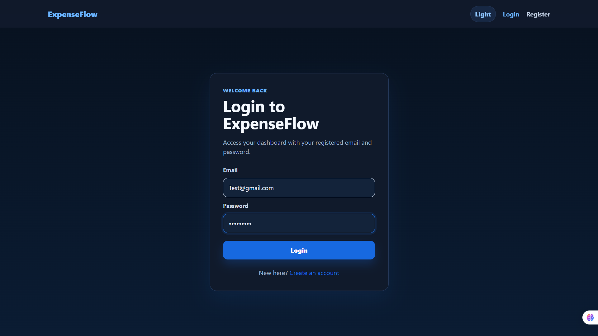
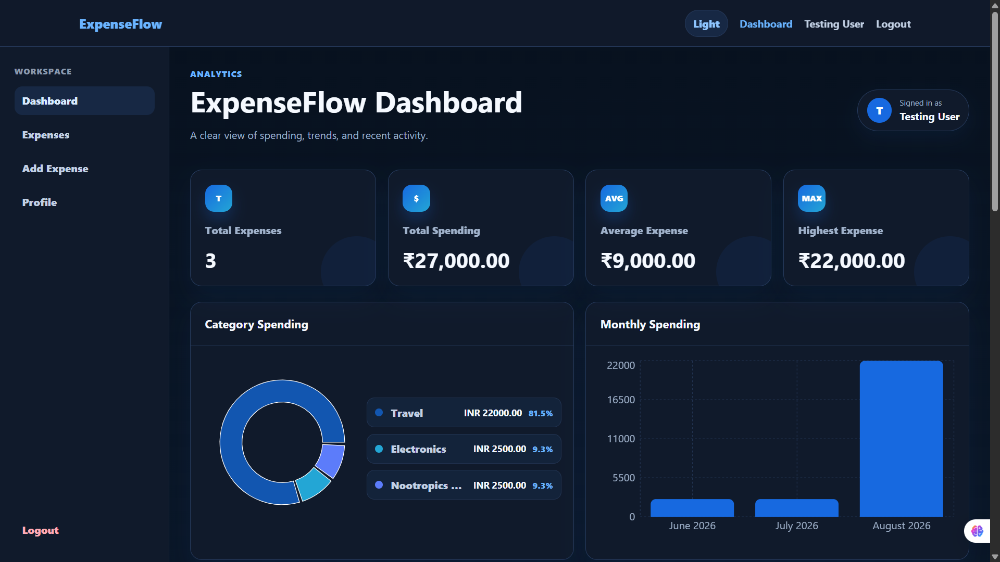
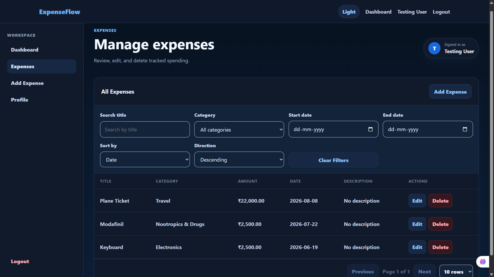
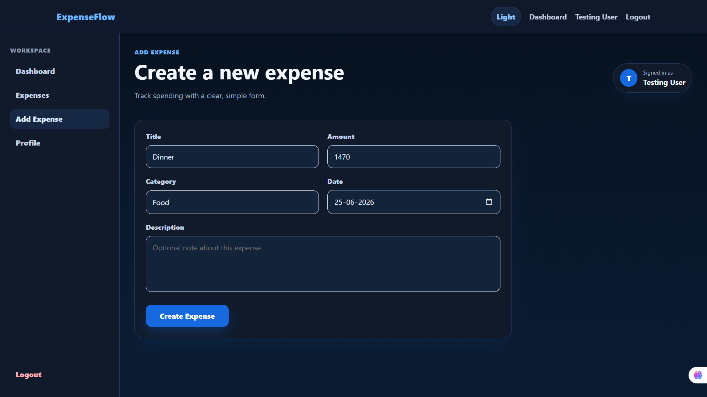

# ExpenseFlow

### Full-Stack Personal Expense Management Platform

ExpenseFlow is a full-stack expense management application designed to help users securely track, manage, and analyze their personal expenses through a modern web interface.

The application combines a React + Vite frontend with a Spring Boot REST API, JWT-based authentication, and a MySQL relational database. The production application is deployed using Vercel and Railway.

---


### 🌐 Application

**[Open ExpenseFlow](https://expense-flow-kohl-ten.vercel.app/)**

### 📚 Production API Documentation

**[Open Swagger UI](https://expenseflow-production-d9e1.up.railway.app/swagger-ui/index.html)**

### 🔗 Backend API

**[ExpenseFlow API](https://expenseflow-production-d9e1.up.railway.app/)**

> The frontend is hosted on Vercel, while the Spring Boot backend and MySQL database are hosted on Railway.

---
---

## 📸 Screenshots

### Login



### Dashboard



### Expenses



### Add Expense


---

## ✨ Features

### 🔐 Authentication & Authorization

- User registration and login
- JWT-based authentication
- Protected application routes
- Secure password handling
- Authenticated API requests
- Logout functionality
- User-specific expense data

### 💰 Expense Management

- Add new expenses
- View expenses
- Update existing expenses
- Delete expenses
- Categorize expenses
- Track expense amounts and dates
- User-specific expense records

### 📊 Dashboard & Analytics

- Expense summary dashboard
- Spending insights
- Category-based spending information
- Monthly spending information
- Recent expense information
- Visual spending analysis

### 👤 User Management

- User registration
- User authentication
- Profile information
- User-specific data isolation

### 🛡️ Backend & API

- RESTful API architecture
- Spring Boot backend
- Spring Data JPA / Hibernate
- MySQL relational database
- DTO-based API responses
- Centralized exception handling
- JWT security filter
- OpenAPI / Swagger documentation
- CORS configuration

### 🚀 Production Deployment

- React frontend deployed on Vercel
- Spring Boot backend deployed on Railway
- MySQL database deployed on Railway
- Production environment variables
- GitHub-based deployment workflow
- Separate development and production configuration

---

## 🏗️ System Architecture

```text
                         ┌──────────────────────────┐
                         │        User Browser      │
                         │                          │
                         │     React + Vite UI      │
                         └────────────┬─────────────┘
                                      │
                                      │ HTTPS / REST API
                                      ▼
                         ┌──────────────────────────┐
                         │       Spring Boot        │
                         │       REST Backend       │
                         │                          │
                         │  Controllers             │
                         │  Services                │
                         │  Security / JWT          │
                         │  DTOs                    │
                         │  Exception Handling      │
                         └────────────┬─────────────┘
                                      │
                                      │ JPA / Hibernate
                                      ▼
                         ┌──────────────────────────┐
                         │          MySQL           │
                         │      Relational DB       │
                         └──────────────────────────┘


        Deployment
        ───────────────────────────────────────────

             Vercel                  Railway
        ┌───────────────┐      ┌─────────────────┐
        │ React/Vite    │ ───► │ Spring Boot API │
        │ Frontend      │      └────────┬────────┘
        └───────────────┘               │
                                        ▼
                                ┌─────────────────┐
                                │ Railway MySQL   │
                                └─────────────────┘
````

---

## 🛠️ Tech Stack

### Frontend

* React
* Vite
* JavaScript
* CSS
* React Router
* Fetch/API integration

### Backend

* Java
* Spring Boot
* Spring Web
* Spring Data JPA
* Hibernate
* Spring Security
* JWT
* Maven

### Database

* MySQL

### API

* REST
* JSON
* OpenAPI
* Swagger UI

### Development Tools

* Git
* GitHub
* Visual Studio Code
* Maven
* npm

### Deployment

* Vercel — Frontend
* Railway — Backend
* Railway — MySQL Database

---

## 📁 Project Structure

```text
ExpenseFlow/
│
├── expenseflow/
│   ├── src/
│   │   ├── main/
│   │   │   ├── java/
│   │   │   │   └── expenseflow/
│   │   │   │       └── expenseflow/
│   │   │   │           ├── config/
│   │   │   │           ├── controller/
│   │   │   │           ├── dto/
│   │   │   │           ├── entity/
│   │   │   │           ├── exception/
│   │   │   │           ├── repository/
│   │   │   │           ├── security/
│   │   │   │           ├── service/
│   │   │   │           └── util/
│   │   │   │
│   │   │   └── resources/
│   │   │       ├── application.properties
│   │   │       └── application-example.properties
│   │   │
│   │   └── test/
│   │
│   ├── pom.xml
│   ├── mvnw
│   ├── mvnw.cmd
│   ├── API_DOCUMENTATION.md
│   └── README.md
│
├── frontend/
│   ├── public/
│   ├── src/
│   │   ├── components/
│   │   ├── context/
│   │   ├── hooks/
│   │   ├── pages/
│   │   ├── services/
│   │   ├── styles/
│   │   └── utils/
│   ├── package.json
│   └── vite.config.js
│
├── .gitignore
├── README.md
└── package-lock.json
```

---

# 🔑 Authentication Flow

ExpenseFlow uses JWT-based authentication.

```text
1. User registers
        │
        ▼
2. Backend validates registration data
        │
        ▼
3. User logs in
        │
        ▼
4. Backend authenticates credentials
        │
        ▼
5. Backend generates JWT
        │
        ▼
6. Frontend stores authentication state
        │
        ▼
7. Authenticated requests include JWT
        │
        ▼
8. JWT security filter validates the request
        │
        ▼
9. Protected resources are accessed
```

This allows the backend to enforce authentication independently from the frontend.

---

# 🔌 API Documentation

ExpenseFlow provides an OpenAPI-documented REST API.

### Production Swagger UI

**[View the API documentation](https://expenseflow-production-d9e1.up.railway.app/swagger-ui/index.html)**

The API includes endpoints for:

* Authentication
* User management
* Expense management
* Dashboard data
* Spending information

For additional API documentation, see:

```text
expenseflow/API_DOCUMENTATION.md
```

---

# 💻 Local Development

## Prerequisites

Make sure the following are installed:

* Java 21
* Node.js
* npm
* MySQL
* Git

---

## 1. Clone the repository

```bash
git clone https://github.com/vaishalisahu017/ExpenseFlow.git
cd ExpenseFlow
```

---

# 2. Backend Setup

Navigate to the backend:

```bash
cd expenseflow
```

The backend uses environment variables for database credentials, JWT configuration, and frontend origin.

Create your local environment configuration based on:

```text
expenseflow/src/main/resources/application-example.properties
```

Configure the required values for your local MySQL instance.

The application expects variables such as:

```text
DB_URL
DB_USERNAME
DB_PASSWORD
JWT_SECRET
JWT_EXPIRATION_SECONDS
FRONTEND_ORIGIN
JPA_SHOW_SQL
```

> Never commit real database credentials, JWT secrets, API keys, or other sensitive configuration to GitHub.

---

## 3. Start the Spring Boot backend

### Windows

```bash
.\mvnw.cmd spring-boot:run
```

### macOS / Linux

```bash
./mvnw spring-boot:run
```

The backend will normally be available at:

```text
http://localhost:8080
```

Swagger UI:

```text
http://localhost:8080/swagger-ui/index.html
```

---

# 4. Frontend Setup

Open another terminal and navigate to:

```bash
cd frontend
```

Install dependencies:

```bash
npm install
```

Create the frontend environment file based on:

```text
frontend/.env.example
```

Configure the frontend to communicate with your local Spring Boot backend.

Then start Vite:

```bash
npm run dev
```

The frontend will normally be available at:

```text
http://localhost:5173
```

---

# 🧪 Testing

The backend contains Spring Boot test infrastructure.

Run backend tests with:

### Windows

```bash
cd expenseflow
.\mvnw.cmd test
```

### macOS / Linux

```bash
cd expenseflow
./mvnw test
```

For manual application testing, verify:

* Registration
* Login
* Logout
* Protected routes
* Add expense
* Edit expense
* Delete expense
* Dashboard calculations
* Expense persistence
* Invalid authentication
* Unauthorized requests

---

# 🌍 Production Deployment

ExpenseFlow is deployed as a multi-service full-stack application.

## Frontend

The React/Vite frontend is deployed on:

**Vercel**

Production application:

**[ExpenseFlow](https://expense-flow-kohl-ten.vercel.app/)**

The Vercel deployment is connected to the GitHub repository and builds the frontend application.

---

## Backend

The Spring Boot REST API is deployed on:

**Railway**

Production API:

**[ExpenseFlow Backend](https://expenseflow-production-d9e1.up.railway.app/)**

Railway builds and runs the Spring Boot application using the project's backend configuration.

---

## Database

The production MySQL database is hosted on Railway.

The backend connects to the production database through environment variables rather than hard-coded credentials.

The production configuration uses:

```text
DB_URL
DB_USERNAME
DB_PASSWORD
JWT_SECRET
JWT_EXPIRATION_SECONDS
FRONTEND_ORIGIN
```

Sensitive production values are stored in the deployment platform rather than committed to GitHub.

---

# 🔐 Security

ExpenseFlow follows several basic security practices:

* JWT-based authentication
* Protected API endpoints
* User-specific data access
* Environment-based secret management
* Sensitive files excluded through `.gitignore`
* Production secrets stored outside the source repository
* CORS configuration
* Centralized exception handling

### Important

Do not commit:

```text
.env
application-local.properties
database passwords
JWT secrets
API keys
```

Production secrets should always be configured through the deployment platform's environment-variable system.

---

# 📚 Additional Documentation

Additional backend/API documentation is available in:

```text
expenseflow/API_DOCUMENTATION.md
```

Backend-specific information:

```text
expenseflow/README.md
```

---

# 🔄 Development Workflow

The project follows a simple Git-based development workflow:

```text
Local Development
       │
       ▼
Test locally
       │
       ▼
Git commit
       │
       ▼
Push to GitHub
       │
       ├──────────────► Vercel
       │                  │
       │                  ▼
       │              Frontend
       │
       └──────────────► Railway
                          │
                          ▼
                    Spring Boot API
                          │
                          ▼
                      MySQL
```

Changes pushed to the production branch can trigger new deployments on the connected hosting platforms.

---

# 🎯 Project Goals

ExpenseFlow was developed to demonstrate practical full-stack software development concepts, including:

* Frontend development
* Backend API development
* Database design and persistence
* Authentication and authorization
* RESTful architecture
* API documentation
* Environment-based configuration
* Cloud deployment
* Git-based development workflow

---

# 🚧 Future Improvements

Potential future improvements include:

* Automated CI/CD testing pipeline
* Advanced expense filtering
* Budget management
* Recurring expenses
* Export reports to CSV/PDF
* More detailed analytics
* Automated database migrations
* Email notifications
* Improved test coverage
* Role-based administrative features

---

# 👨‍💻 Maintainer

**Vaishali Sahu**

GitHub:

**[@vaishalisahu017](https://github.com/vaishalisahu017)**

---

# 📄 License

This project is currently intended as a portfolio and educational project.

If you plan to redistribute or modify the project, please contact the maintainer regarding licensing.

````
